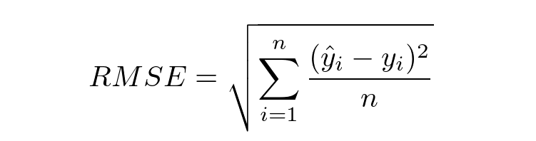

# Laporan Proyek Machine Learning - Rizka Indah Puspita

## Project Overview
Buku merupakan sumber ilmu terbaik untuk memperluas wawasan, meningkatkan keterampilan berpikir kritis dan mendapatkan hiburan. Namun, dengan banyaknya pilihan buku yang tersedia, menemukan buku yang sesuai dengan preferensi dan kebutuhan pengguna bisa menjadi tantangan. Oleh karena itu, sistem rekomendasi buku hadir sebagai solusi untuk membantu pengguna menemukan buku yang sesuai dengan minat mereka [[1]](https://kumparan.com/muhammad-yusuf-ardiansyah/buku-sebagai-sarana-penting-untuk-membangun-karakter-dan-pengetahuan-23Tqe8Z1AUN/full?utm_source=chatgpt.com).

Proyek "Rekomendasi Buku untuk Pengguna" bertujuan untuk mengembangkan sistem yang dapat memberikan rekomendasi buku berdasarkan berbagai faktor, seperti genre favorit, ulasan pengguna, popularitas, dan preferensi pribadi. Dengan menerapkan teknik berbasis data, seperti algoritma machine learning atau filtering berbasis konten dan kolaboratif, sistem ini diharapkan dapat memberikan rekomendasi yang lebih akurat dan relevan bagi setiap pengguna [[2]](https://ejournal.undip.ac.id/index.php/jmasif/article/view/31482?utm_source=chatgpt.com).

## Business Understanding

### Problem Statements
- Bagaimana cara menyajikan rekomendasi buku yang sesuai dengan preferensi pengguna?
- Algoritma machine learning apa yang bisa membantu untuk rekomendasi buku kepada pengguna?

### Goals
- Mengembangkan sistem rekomendasi buku yang dapat membantu pengguna menemukan buku sesuai dengan minat mereka.
- Menerapkan teknik berbasis data seperti machine learning dengan menggunakan collaborative filtering untuk meningkatkan akurasi rekomendasi.

### Solution Statements
- Untuk mengatasi permasalahan ini, proyek ini akan mengembangkan sistem rekomendasi buku berbasis machine learning yang menggunakan Collaborative Filtering untuk memberikan rekomendasi buku yang lebih akurat dan personal bagi pengguna. Sistem ini menganalisis pola interaksi pengguna dengan buku, seperti riwayat pembacaan dan rating, untuk mengidentifikasi preferensi mereka. Dengan pendekatan ini, pengguna dapat menemukan buku yang sesuai dengan minat mereka, bahkan jika mereka belum pernah membaca buku serupa sebelumnya.

- Untuk meningkatkan akurasi rekomendasi, sistem akan menerapkan [(Neural Collaborative Filtering (NCF))](https://medium.com/data-science-in-your-pocket/recommendation-systems-using-neural-collaborative-filtering-ncf-explained-with-codes-21a97e48a2f7) atau Matrix Factorization guna menangkap hubungan laten antara pengguna dan buku. Selain itu, model dapat diperluas dengan Hybrid Filtering, yang mengombinasikan Content-Based Filtering untuk mempertimbangkan fitur buku seperti genre, penulis, dan deskripsi.

## Data Understanding

### Deskripsi Variabel
**Informasi Datasets**

| Jenis | Keterangan |
| ------ | ------ |
| Title | Book-Crossing: User review ratings |
| Source | [Kaggle](https://www.kaggle.com/datasets/ruchi798/bookcrossing-dataset/data) |
| Maintainer | [Ruchi Bhatia ](https://www.kaggle.com/ruchi798)|
| License | Other (specified in description) |
| Visibility | Publik |
| Tags | Arts and Entertainment, Online Communities, Literature  |
| Usability | 10.00 |

Setelah melakukan observasi pada dataset yang diunduh pada kaggle, didapatakan informasi sebagai berikut :

- Data berjumlah 1031175 sample (records)
- Terdiri dari 19 fitur/kolom ('Unnamed: 0', 'user_id', 'location', 'age', 'isbn', 'rating', 'book_title', 'book_author', 'year_of_publication', 'publisher', 'img_s', 'img_m', 'img_l', 'Summary', 'Language', 'Category', 'city', 'state', 'country')
- Terdiri dari 3 fitur/kolom numerik dengan tipe data int64 (Unnamed: 0, user_id, rating). Ini merupakan fitur numerik. Tetapi untuk fitur/kolom Unnamed: 0 merupakan fitur yang tidak diperlukan dan bisa dibuang.
- Terdiri dari 2 fitur/kolom numerik dengan tipe data float64 yaitu: age dan year_of_publication. Ini merupakan fitur numerik.
- Terdiri dari 14 fitur/kolom dengan tipe object (location, isbn, book_title,book_author, publisher, img_s, img_m, img_l, Summary, Language, Category, city, state, country). fitur/Kolom ini merupakan categorical features (fitur non-numerik) dimana fitur/kolom ini merupakan target fitur.

### Variable - variable pada 
1. `Unnamed: 0`: index pada data
2. `user_id`: Penomoran unik untuk tiap data dari pengguna
3. `location`: lokasi/alamat pengguna
4. `age`: umur pengguna
5. `isbn`: kode ISBN (International Standard Book Number) buku
6. `rating`: rating dari buku
7. `book_title`: judul buku
8. `book_author`: penulis buku
9. `year_of_publication`: tahun terbit buku
10. `publisher`: penerbit buku
11. `img_s`: gambar sampul buku (small)
12. `img_m`: gambar sampul buku (medium)
13. `img_l`: gambar sampul buku (large)
14. `Summary`: ringkasan/sinopsis buku
15. `Language`: bahasa yang digunakan buku
16. `Category`: kategori buku
17. `city`: Nama kota pengguna
18. `state`: Negara bagian pengguna
19. `country`: negara pengguna

### EDA 
Pada proyek ini data akan di explore lebih jauh untuk melihat hasil analisa yang di dapatkan dengan menampilkan dengan visualisasi chart.
-  Top 10 dari Tahun Penerbitan, Penulis dan Buku

    - Berdasarkan Top 10 Tahun Penerbitan

        
    
        Pada gambar diatas dapat disimpulkan:
       
        - Dari hasil visualisasi diatas didapatkan informasi top 10 tahun penerbitan yaitu tahun 1995, 1996, 1997, 1994, 1998, 2000, 2003, 1999, 2001 dan 2002.
        - Untuk tahun penerbitan tertinggi berada pada tahun 2002 dengan jumlah bukunya mencapai 87.088k.
    

    - Berdasarkan Top 10 Tahun Penulis

        
    
        Pada gambar diatas dapat disimpulkan:
        - Berdasarkan hasil visualisasi, diperoleh informasi bahwa 10 penulis favorit dengan jumlah buku terbanyak adalah Janet Evanovich, Sue Grafton, Danielle Steel, Tom Clancy, Dean R. Koontz, Mary Higgins Clark, James Patterson, John Grisham, Nora Roberts, dan                Stephen King.
        - Stephen King menempati posisi pertama sebagai penulis dengan jumlah buku terbanyak, dengan total 9.679 buku yang telah diterbitkan.

    - Distribusi Umur Pengguna

        
    
        Pada gambar diatas dapat disimpulkan:
        - Berdasarkan hasil visualisasi di atas didapatkan informasi bahwa umur pengguna/user berada pada rentang 5 - 99 tahun.
        - Pada hasil visualisai juga terlihat sebagian besar pengguna berada pada kisaran 30-34 tahun dengan jumlah pengguna terbanyak.

## Data Preparation

### Membersihkan Data
Dalam proyek ini dataset yang sudah di persiapkan selanjutkan akan dibersihkan. Pada proses _Data Preparation_ yang dilakukan adalah seperti:
- Menghapus kolom atau fitur yang tidak diperlukan. 

 Pada tahap ini menghapus fitur yang tidak diperlukan seperti fitur `Unnamed: 0`, `img_s`, `img_m`, `img_l` yang hanya berisi gambar dari sampul buku tersebut.

- Mengganti tipe data pada fitur `age` dan `year_of_publication`

Pada tahap ini fitur `age` dan `year_of_publication` yang sebelumnya bertipe data float64 dirubah atau diganti menjadi int64 supaya tipe data lebih sesuai.

- Missing Value 

Beberapa fitur/column yang memiliki data kosong/Null/NA. Data akan di hapus supaya data lebih akurat. Fitur yang memiliki missing value dan perlu dihapus yaitu:

|Fitur  |Total Record|
|-------|------------|
|book_author |	1 |
|city	|14103|
|state	|22798|
|country	|35374|

- Melakukan Text Cleaning pada Data.

Pada tahap text cleaning ini membantu pembersihan text pada kolom atau fitur *Category* dan *book_title*.
Di bagian fitur *Category* mengganti simbol | (delimiter kategori) dengan spasi sehingga kategori lebih mudah dibaca. Sedangkan di bagian *book_title* karena masih belum seragam dan mengandung karakter yang tidak diperlukan, sehingga proses pembersihan teks (text cleaning) perlu dilakukan. Tahapan yang diterapkan meliputi mengubah teks menjadi huruf kecil (lowercase), menghapus teks dalam tanda kurung siku, menghapus tautan (links), menghilangkan tanda baca (punctuation), menghilangkan links, menghilangkan tag, menghilangkan mentions pada text serta menghapus angka.
    
### Persiapan data untuk model Neural Network.

    Pada persiapan data untuk model Neural Network, terdiri dari 2 tahapan sebagai berikut :

    - Melakukan Proses Encoding Fitur `user_id` dan `isbn` ke dalam indeks integer.

      Pada tahap ini akan dilakukan proses encoding yaitu proses mengubah data non-numerik menjadi data numerik agar model dapat memproses data tersebut. Pada proyek ini, proses encoding dilakukan pada fitur user_id dan isbn dengan memanfaatkan fungsi enumerate. 
      Kemudian memetakan user_id dan isbn ke dataframe yang berkaitan.

    - Pembagian Data untuk Training dan Validasi.

      Pada tahap ini akan melakukan pembagian data menjadi data training dan validasi. Namun sebelum itu, perlu mengacak datanya terlebih dahulu agar distribusinya menjadi random. Kemudian membuat variabel x untuk mencocokkan data user dan buku menjadi satu 
      value, lalu membuat variabel y untuk membuat rating dari hasil. Setelah itu membagi menjadi 80% data train dan 20% data validasi. Setelah melakukan pembagian dataset, didapatkan jumlah sample pada data train yaitu 785823 sampel dan jumlah sample pada data 
      validasi yaitu 196456 sampel.

## Modeling
Proses pemodelan pada data ini dilakukan dengan menerapkan algoritma machine learning menggunakan teknik *collaborative filtering*. Dalam proyek ini, sistem rekomendasi dikembangkan menggunakan pendekatan Item-Based Collaborative Filtering dengan algoritma Deep Learning atau Neural Network untuk meningkatkan akurasi rekomendasi.

### Dengan pendekatan Deep learning atau Neural Network.
Untuk membangun model ini, digunakan pendekatan Deep Learning dengan Neural Network untuk menghitung skor kecocokan antara pengguna dan buku menggunakan teknik embedding.
Prosesnya dimulai dengan embedding pada data user dan buku, kemudian dilakukan perkalian dot product antara keduanya untuk menentukan tingkat kesesuaian. Selain itu, ditambahkan bias untuk setiap user dan buku guna meningkatkan akurasi prediksi. Skor kecocokan kemudian ditetapkan dalam skala [0,1] menggunakan fungsi aktivasi sigmoid.

Model ini dibangun menggunakan class RecommenderNet dalam Keras Model class. Setelah itu, dilakukan proses kompilasi dengan:

- Loss function: Binary Crossentropy
- Optimizer: Adam (Adaptive Moment Estimation)
- Metrik Evaluasi: Root Mean Squared Error (RMSE)

Berikut hasil dari penggunaaan RecommenderNet:

## Evaluation
Pada proyek ini menggunakan metrik RMSE (Root Mean Square Error) untuk mengevaluasi kinerja model yang dihasilkan. RMSE adalah cara standar untuk mengukur kesalahan model dalam memprediksi data kuantitatif. Root Mean Squared Error (RMSE) mengevaluasi model regresi linear dengan mengukur tingkat akurasi hasil perkiraan suatu model. RMSE dihitung dengan mengkuadratkan error (prediksi – observasi) dibagi dengan jumlah data (= rata-rata), lalu diakarkan. Perhitungan RMSE ditunjukkan pada rumus berikut ini.

`RMSE` = nilai root mean square error

`y` = nilai hasil observasi

`ŷ` = nilai hasil prediksi

`i` = urutan data

`n` = jumlah data

Nilai RMSE rendah menunjukkan bahwa variasi nilai yang dihasilkan oleh suatu model prakiraan mendekati variasi nilai obeservasinya. RMSE menghitung seberapa berbedanya seperangkat nilai. Semakin kecil nilai RMSE, semakin dekat nilai yang diprediksi dan diamati.

Berikut ini adalah plot metrik RMSE setelah proses pelatihan model.

Dalam proyek ini, metrik evaluasi yang digunakan adalah Root Mean Squared Error (RMSE).

  - Selama proses training, model menunjukkan konvergensi stabil pada sekitar 100 epochs.
  - Hasil evaluasi:
    - Error akhir pada training: 0.30
    - Error pada validasi: 0.33
    - *Error pada seluruh data: 0.32*
Nilai RMSE yang diperoleh menunjukkan bahwa model memiliki kinerja yang baik dalam merekomendasikan buku, dengan selisih error yang kecil antara training, validasi, dan keseluruhan data.

## _Referensi_
- [1] Muhammad Yusuf Ardiansyah (Sep 8 2024), https://kumparan.com/muhammad-yusuf-ardiansyah/buku-sebagai-sarana-penting-untuk-membangun-karakter-dan-pengetahuan-23Tqe8Z1AUN/full?utm_source
- [2] https://ejournal.undip.ac.id/index.php/jmasif/article/view/31482?utm_source
- Mehul Gupta (Jul 28, 2023), https://medium.com/data-science-in-your-pocket/recommendation-systems-using-neural-collaborative-filtering-ncf-explained-with-codes-21a97e48a2f7
- https://developers.google.com/machine-learning/recommendation/collaborative/basics
- https://scikit-learn.org/stable/modules/generated/sklearn.neighbors.NearestNeighbors.html
- https://www.neliti.com/publications/469572/analisis-perbandingan-model-matrix-factorization-dan-k-nearest-neighbor-dalam-me?utm_source