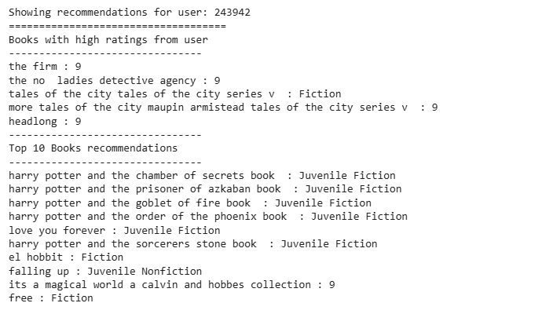

# Laporan Proyek Machine Learning - Rizka Indah Puspita

## Project Overview
Buku merupakan sumber ilmu terbaik untuk memperluas wawasan, meningkatkan keterampilan berpikir kritis dan mendapatkan hiburan. Namun, dengan banyaknya pilihan buku yang tersedia, menemukan buku yang sesuai dengan preferensi dan kebutuhan pengguna bisa menjadi tantangan. Oleh karena itu, sistem rekomendasi buku hadir sebagai solusi untuk membantu pengguna menemukan buku yang sesuai dengan minat mereka.[[1]](https://kumparan.com/muhammad-yusuf-ardiansyah/buku-sebagai-sarana-penting-untuk-membangun-karakter-dan-pengetahuan-23Tqe8Z1AUN/full?utm_source=chatgpt.com)

Proyek "Rekomendasi Buku untuk Pengguna" bertujuan untuk mengembangkan sistem yang dapat memberikan rekomendasi buku berdasarkan berbagai faktor, seperti genre favorit, ulasan pengguna, popularitas, dan preferensi pribadi. Dengan menerapkan teknik berbasis data, seperti algoritma machine learning atau filtering berbasis konten dan kolaboratif, sistem ini diharapkan dapat memberikan rekomendasi yang lebih akurat dan relevan bagi setiap pengguna.[[2]](https://ejournal.undip.ac.id/index.php/jmasif/article/view/31482?utm_source=chatgpt.com)

## Business Understanding

### Problem Statements
Dengan banyaknya pilihan buku yang tersedia, pengguna sering mengalami kesulitan dalam menemukan buku yang sesuai dengan preferensi dan kebutuhan mereka. Proses pencarian ini dapat memakan waktu dan tidak selalu menghasilkan pilihan yang tepat. Oleh karena itu, diperlukan sistem yang dapat memberikan rekomendasi buku yang akurat dan relevan berdasarkan minat dan kebiasaan membaca pengguna.

### Goals
- Mengembangkan sistem rekomendasi buku yang dapat membantu pengguna menemukan buku sesuai dengan minat mereka.
- Meningkatkan kepuasan pengguna dengan rekomendasi yang lebih personalized dan relevan.
- Menerapkan teknik berbasis data seperti machine learning, content-based filtering, dan collaborative filtering untuk meningkatkan akurasi rekomendasi.

### Solution Statements
Untuk mengatasi permasalahan ini, proyek ini akan mengembangkan sistem rekomendasi buku dengan menggunakan berbagai teknik berbasis data. Sistem akan menganalisis faktor-faktor seperti genre favorit, buku dengan rating terbanyak, dan popularitas buku untuk menghasilkan rekomendasi yang lebih akurat. Pendekatan yang digunakan mencakup machine learning, [content-based filtering](https://www.ibm.com/think/topics/content-based-filtering?utm_source=chatgpt.com), dan [collaborative filtering](https://developers.google.com/machine-learning/recommendation/collaborative/basics), sehingga setiap pengguna dapat menerima rekomendasi buku yang sesuai dengan preferensi mereka secara lebih efisien.

## Data Understanding

### Deskripsi Variabel
**Informasi Datasets**

| Jenis | Keterangan |
| ------ | ------ |
| Title | Book-Crossing: User review ratings |
| Source | [Kaggle](https://www.kaggle.com/datasets/ruchi798/bookcrossing-dataset/data) |
| Maintainer | [Ruchi Bhatia ](https://www.kaggle.com/ruchi798)|
| License | Other (specified in description) |
| Visibility | Publik |
| Tags | Arts and Entertainment, Online Communities, Literature  |
| Usability | 10.00 |

Setelah melakukan observasi pada dataset yang diunduh pada kaggle, didapatakan informasi sebagai berikut :

- Data berjumlah 1031175 sample (records)
- Terdiri dari 19 fitur/kolom ('Unnamed: 0', 'user_id', 'location', 'age', 'isbn', 'rating', 'book_title', 'book_author', 'year_of_publication', 'publisher', 'img_s', 'img_m', 'img_l', 'Summary', 'Language', 'Category', 'city', 'state', 'country')
- Terdiri dari 3 fitur/kolom numerik dengan tipe data int64 (Unnamed: 0, user_id, rating). Ini merupakan fitur numerik. Tetapi untuk fitur/kolom Unnamed: 0 merupakan fitur yang tidak diperlukan dan bisa dibuang.
- Terdiri dari 2 fitur/kolom numerik dengan tipe data float64 yaitu: age dan year_of_publication. Ini merupakan fitur numerik.
- Terdiri dari 14 fitur/kolom dengan tipe object (location, isbn, book_title,book_author, publisher, img_s, img_m, img_l, Summary, Language, Category, city, state, country). fitur/Kolom ini merupakan categorical features (fitur non-numerik) dimana fitur/kolom ini merupakan target fitur.

### Variable - variable pada 
1. `Unnamed: 0`: index pada data
2. `user_id`: Penomoran unik untuk tiap data dari pengguna
3. `location`: lokasi/alamat pengguna
4. `age`: umur pengguna
5. `isbn`: kode ISBN (International Standard Book Number) buku
6. `rating`: rating dari buku
7. `book_title`: judul buku
8. `book_author`: penulis buku
9. `year_of_publication`: tahun terbit buku
10. `publisher`: penerbit buku
11. `img_s`: gambar sampul buku (small)
12. `img_m`: gambar sampul buku (medium)
13. `img_l`: gambar sampul buku (large)
14. `Summary`: ringkasan/sinopsis buku
15. `Language`: bahasa yang digunakan buku
16. `Category`: kategori buku
17. `city`: Nama kota pengguna
18. `state`: Negara bagian pengguna
19. `country`: negara pengguna

### Membersihkan data
Dalam proyek ini dataset yang sudah di persiapkan selanjutkan akan dibersihkan. Pada proses _Data Cleaning_ yang dilakukan adalah seperti:
- Menghapus kolom atau fitur yang tidak diperlukan. Fitur yang perlu dihapus yaitu `Unnamed: 0`, `img_s`, `img_m`, `img_l`
- Mengganti tipe data pada fitur `age` dan `year_of_publication`
- Menghapus data yang missing value. Beberapa fitur/column yang memiliki data kosong/Null/NA kita akan hapus supaya data lebih akurat/
- Melakukan text cleaning pada data
### EDA 
Pada proyek ini data akan di explore lebih jauh untuk melihat hasil analisa yang bisa kita dapatkan dengan menampilkan ddengan visualisasi chart.
-  Top 10 dari Tahun Penerbitan, Penulis dan Buku

    1. Berdasarkan Top 10 Tahun Penerbitan
    

    Pada gambar diatas dapat disimpulkan:
    - Dari hasil visualisasi diatas didapatkan informasi top 10 tahun penerbitan yaitu tahun 1995, 1996, 1997, 1994, 1998, 2000, 2003, 1999, 2001 dan 2002.
    - Untuk tahun penerbitan tertinggi berada pada tahun 2002 dengan jumlah bukunya mencapai 87.088k.
    
    2. Berdasarkan Top 10 Tahun Penulis
    

    Pada gambar diatas dapat disimpulkan:
    - Berdasarkan hasil visualisasi, diperoleh informasi bahwa 10 penulis favorit dengan jumlah buku terbanyak adalah Janet Evanovich, Sue Grafton, Danielle Steel, Tom Clancy, Dean R. Koontz, Mary Higgins Clark, James Patterson, John Grisham, Nora Roberts, dan Stephen King.
    - Stephen King menempati posisi pertama sebagai penulis dengan jumlah buku terbanyak, dengan total 9.679 buku yang telah diterbitkan.

    3. Distribusi Umur Pengguna
    

    Pada gambar diatas dapat disimpulkan:
    - Berdasarkan hasil visualisasi di atas didapatkan informasi bahwa umur pengguna/user berada pada rentang 5 - 99 tahun.
    - Pada hasil visualisai juga terlihat sebagian besar pengguna berada pada kisaran 30-34 tahun dengan jumlah pengguna terbanyak.

## Data Preparation
- Persiapan data untuk model KNN Item-Based.
Pada persiapan data untuk model KNN Item-Based terdiri dari 3 tahapan sebagai berikut :

    1. Filtering data buku dengan jumlah rating >= threshold (30).
    - Dari 982.278 buku dalam dataset, hanya 293.037 buku yang mendapat rating dari lebih dari 30 pengguna, sementara sisanya memiliki interaksi yang sangat sedikit atau tidak ada (sparse data). Sparse data ini sulit diprediksi dan dapat menimbulkan noise. Untuk mengatasi hal ini serta mencegah memory error, dilakukan filtering dengan hanya menyertakan buku yang memiliki rating dari lebih dari 30 pengguna. Setelah proses ini, jumlah data yang digunakan menjadi 293.037 buku dan sudah cukup untuk membuat model rekomendasi.

    2. Mengubah format data menjadi pivot tabel.
    Sebelum masuk ke pembuatan model rekomendasi menggunakan KNN, terlebih dahulu kita harus mengubah data rating buku menjadi format yang tepat yang dapat digunakan oleh model KNN. Data rating buku akan diubah menjadi array m x n, dengan m sebagai jumlah buku dan n sebagai jumlah pengguna. Proses ini merangkum data ke dalam pivot table, di mana judul buku menjadi indeks, ID pengguna sebagai kolom, dan rating sebagai nilai. Selanjutnya, nilai yang kosong akan diisi dengan nol. Berikut merupakan pivot tabel yang dihasilkan :

    3. Mengkonversi value (rating) pada pivot tabel ke dalam scipy sparse matrix.
    Pivot tabel yang dihasilkan memiliki ukuran 3602 x 46833 dan dapat dikategorikan sebagai sparse matrix, yaitu matriks dengan sebagian besar nilai nol. Menggunakan seluruh data dalam format float32 untuk model KNN akan sangat tidak efisien dan memakan banyak memori. Oleh karena itu, untuk meningkatkan efisiensi perhitungan dan mengurangi penggunaan memori, pivot tabel dikonversi ke dalam scipy sparse matrix.

- Persiapan data untuk model Neural Network.
Pada persiapan data untuk model Neural Network.terdiri dari 2 tahapan sebagai berikut :

    1. Melakukan Proses Encoding Fitur `user_id` dan `isbn` ke dalam indeks integer.
    Pada tahap ini akan dilakukan proses encoding yaitu proses mengubah data non-numerik menjadi data numerik agar model dapat memproses data tersebut. Pada proyek ini, proses encoding dilakukan pada fitur user_id dan isbn dengan memanfaatkan fungsi enumerate. Kemudian memetakan user_id dan isbn ke dataframe yang berkaitan.

    2. Pembagian Data untuk Training dan Validasi.
    Pada tahap ini kita akan melakukan pembagian data menjadi data training dan validasi. Namun sebelum itu, kita perlu mengacak datanya terlebih dahulu agar distribusinya menjadi random. Kemudian membuat variabel x untuk mencocokkan data user dan buku menjadi satu value, lalu membuat variabel y untuk membuat rating dari hasil. Setelah itu membagi menjadi 80% data train dan 20% data validasi. Setelah melakukan pembagian dataset, didapatkan jumlah sample pada data train yaitu 785823 sampel dan jumlah sample pada data validasi yaitu 196456 sampel.

## Modeling
Proses modeling yang saya lakukan pada data ini adalah dengan membuat algoritma machine learning, yaitu content based filtering dan collabrative filtering.
### KNN

### Neural Network 
Untuk membangun model ini, digunakan pendekatan Deep Learning dengan Neural Network untuk menghitung skor kecocokan antara pengguna dan buku menggunakan teknik embedding.
Prosesnya dimulai dengan embedding pada data user dan buku, kemudian dilakukan perkalian dot product antara keduanya untuk menentukan tingkat kesesuaian. Selain itu, ditambahkan bias untuk setiap user dan buku guna meningkatkan akurasi prediksi. Skor kecocokan kemudian ditetapkan dalam skala [0,1] menggunakan fungsi aktivasi sigmoid.

Model ini dibangun menggunakan class RecommenderNet dalam Keras Model class. Setelah itu, dilakukan proses kompilasi dengan:

- Loss function: Binary Crossentropy
- Optimizer: Adam (Adaptive Moment Estimation)
- Metrik Evaluasi: Root Mean Squared Error (RMSE)

Berikut hasil dari penggunaaan RecommenderNet:

## Evaluation
Pada proyek ini menggunakan metrik RMSE (Root Mean Square Error) untuk mengevaluasi kinerja model yang dihasilkan. RMSE adalah cara standar untuk mengukur kesalahan model dalam memprediksi data kuantitatif [2]. Root Mean Squared Error (RMSE) mengevaluasi model regresi linear dengan mengukur tingkat akurasi hasil perkiraan suatu model. RMSE dihitung dengan mengkuadratkan error (prediksi – observasi) dibagi dengan jumlah data (= rata-rata), lalu diakarkan. Perhitungan RMSE ditunjukkan pada rumus berikut ini.

[rmse](https://camo.githubusercontent.com/fb3074371fe1d8136465f041c4202109b7d7d019a53062738ec1f3d06394c1dd/68747470733a2f2f692e706f7374696d672e63632f74676a666e745a6b2f524d53452e706e67),

`RMSE` = nilai root mean square error

`y` = nilai hasil observasi

`ŷ` = nilai hasil prediksi

`i` = urutan data

`n` = jumlah data

Nilai RMSE rendah menunjukkan bahwa variasi nilai yang dihasilkan oleh suatu model prakiraan mendekati variasi nilai obeservasinya. RMSE menghitung seberapa berbedanya seperangkat nilai. Semakin kecil nilai RMSE, semakin dekat nilai yang diprediksi dan diamati.

Berikut ini adalah plot metrik RMSE setelah proses pelatihan model.

Dalam proyek ini, metrik evaluasi yang digunakan adalah Root Mean Squared Error (RMSE).

  - Selama proses training, model menunjukkan konvergensi stabil pada sekitar 100 epochs.
  - Hasil evaluasi:
    - Error akhir pada training: 0.30
    - Error pada validasi: 0.33
    - *Error pada seluruh data: 0.32*
Nilai RMSE yang diperoleh menunjukkan bahwa model memiliki kinerja yang baik dalam merekomendasikan buku, dengan selisih error yang kecil antara training, validasi, dan keseluruhan data.

## _Referensi_
- [1] Muhammad Yusuf Ardiansyah (8 Sep 2024), https://kumparan.com/muhammad-yusuf-ardiansyah/buku-sebagai-sarana-penting-untuk-membangun-karakter-dan-pengetahuan-23Tqe8Z1AUN/full?utm_source=chatgpt.com
- [2] https://ejournal.undip.ac.id/index.php/jmasif/article/view/31482?utm_source=chatgpt.com
- Jacob Murel Ph.D., https://www.ibm.com/think/topics/content-based-filtering?utm_source=chatgpt.com
- https://developers.google.com/machine-learning/recommendation/collaborative/basics
- https://scikit-learn.org/stable/modules/generated/sklearn.neighbors.NearestNeighbors.html